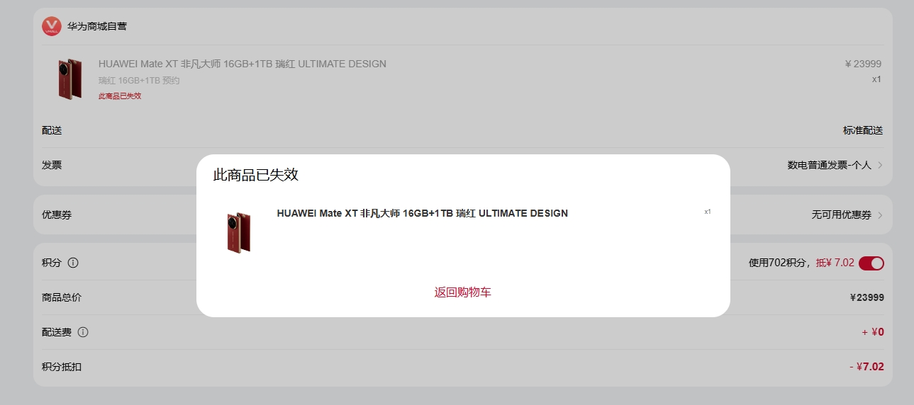
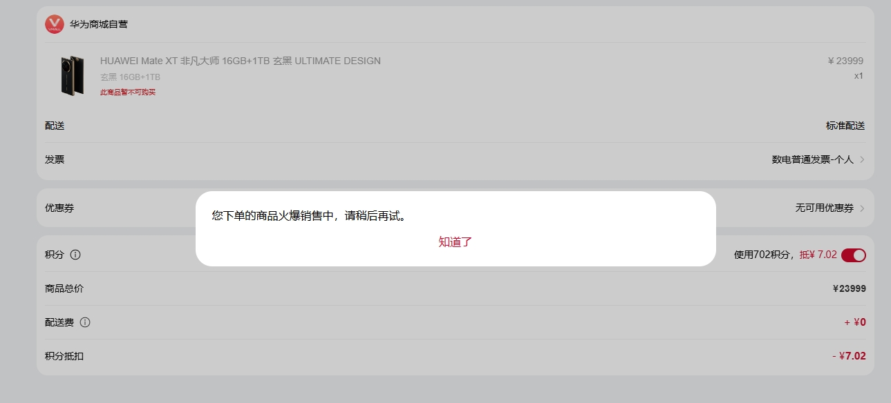

# mate-xt
华为Mate XT 非凡大师 抢购辅助

## 实现原理
主要使用[DrissionPage](https://www.drissionpage.cn/)库来模拟浏览器操作,项目地址[https://github.com/g1879/DrissionPage](https://github.com/g1879/DrissionPage)

华为商城可以通过商品的skuid来进行强制下单

测试商品地址：

HUAWEI 5A 数据线 （ 白色 ）  https://m.vmall.com/order/confirm?skuIdAndQtys=10086361107107:1

## 获取当天商品skuid

在商品页面审查网页元素，一般是在下面这个元素里，搜索“sbomId”,即可找到对应商品的skuid

抢购的商品每天的skuid好像会变化，其他固定商品应该是不变的

失效的提交也没有用

不可购买的会提示下单火爆，这个才是有可能能提交成功的商品

## 特色功能

可同时启动多个浏览器、多标签页同步执行提交操作

目前支持Chrome和Edge浏览器，由于华为商城登录可能会需要验证码，需要先执行登录操作

这里默认设置了浏览器的启动端口方便后续的操作可以顺利接管

辅助下单，感觉没啥用

感觉还是手机APP成功的多

